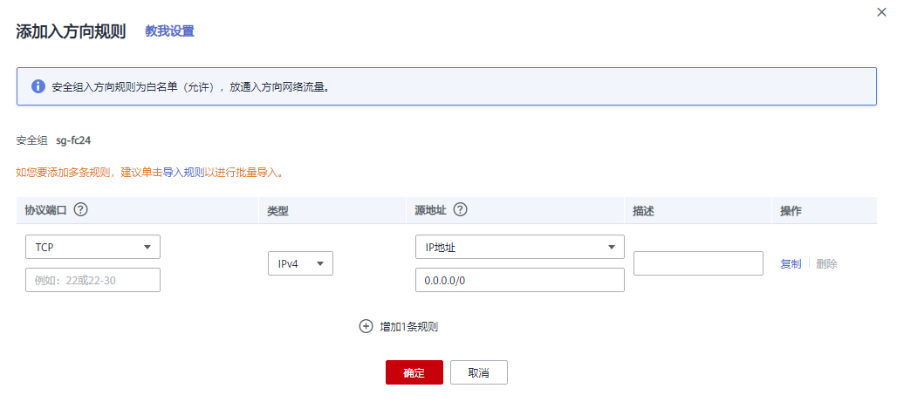

# 添加安全组规则<a name="zh-cn_topic_0030969470"></a>

## 操作场景<a name="s480ea51d8f2542828c323c6c8eb50861"></a>

安全组创建后，您可以在安全组中设置出方向、入方向规则，这些规则会对安全组内部的弹性云服务器出入方向网络流量进行访问控制，当弹性云服务器加入该安全组后，即受到这些访问规则的保护。

-   入方向：指从外部访问安全组规则下的弹性云服务器。
-   出方向：指安全组规则下的弹性云服务器访问安全组外的实例。

常用的安全组规则配置示例请参见[安全组配置示例简介](安全组配置示例简介.md)。

## 操作步骤<a name="section2999103814551"></a>

1.  登录管理控制台。
2.  在管理控制台左上角单击图标，选择区域和项目。
3.  在系统首页，单击“网络 \> 虚拟私有云”。
4.  在左侧导航树选择“安全组”。
5.  在安全组界面，单击操作列的“配置规则”，进入安全组详情界面。
6.  在入方向规则页签，单击“添加规则”，添加入方向规则。

    单击“+”可以依次增加多条入方向规则。

    **图 1**  添加入方向规则<a name="fig73195191822"></a>  
    

    **表 1**  入方向参数说明

    <a name="table532116198213"></a>
    <table><thead align="left"><tr id="row731911191722"><th class="cellrowborder" valign="top" width="8%" id="mcps1.2.4.1.1"><p id="p17319119020"><a name="p17319119020"></a><a name="p17319119020"></a>参数</p>
    </th>
    <th class="cellrowborder" valign="top" width="74%" id="mcps1.2.4.1.2"><p id="p431911191622"><a name="p431911191622"></a><a name="p431911191622"></a>说明</p>
    </th>
    <th class="cellrowborder" valign="top" width="18%" id="mcps1.2.4.1.3"><p id="p103191119621"><a name="p103191119621"></a><a name="p103191119621"></a>取值样例</p>
    </th>
    </tr>
    </thead>
    <tbody><tr id="row8320419723"><td class="cellrowborder" valign="top" width="8%" headers="mcps1.2.4.1.1 "><p id="p1432013199214"><a name="p1432013199214"></a><a name="p1432013199214"></a>协议</p>
    </td>
    <td class="cellrowborder" valign="top" width="74%" headers="mcps1.2.4.1.2 "><p id="p432017191726"><a name="p432017191726"></a><a name="p432017191726"></a>网络协议。</p>
    </td>
    <td class="cellrowborder" valign="top" width="18%" headers="mcps1.2.4.1.3 "><p id="p1332014191216"><a name="p1332014191216"></a><a name="p1332014191216"></a>TCP</p>
    </td>
    </tr>
    <tr id="row1732101910217"><td class="cellrowborder" rowspan="2" valign="top" width="8%" headers="mcps1.2.4.1.1 "><p id="p16320131918211"><a name="p16320131918211"></a><a name="p16320131918211"></a>端口和源地址</p>
    <p id="p203213191023"><a name="p203213191023"></a><a name="p203213191023"></a></p>
    </td>
    <td class="cellrowborder" valign="top" width="74%" headers="mcps1.2.4.1.2 "><p id="p0320141916219"><a name="p0320141916219"></a><a name="p0320141916219"></a>端口：允许远端地址访问弹性云服务器指定端口，取值范围为：1～65535。常用端口请参见<a href="弹性云服务器常用端口.md">弹性云服务器常用端口</a>。</p>
    </td>
    <td class="cellrowborder" valign="top" width="18%" headers="mcps1.2.4.1.3 "><p id="p332121914218"><a name="p332121914218"></a><a name="p332121914218"></a>22或22-30</p>
    </td>
    </tr>
    <tr id="row2032111191124"><td class="cellrowborder" valign="top" headers="mcps1.2.4.1.1 "><p id="p1632116191821"><a name="p1632116191821"></a><a name="p1632116191821"></a>源地址：可以是IP地址，也可以是安全组。例如：</p>
    <p id="p123211198214"><a name="p123211198214"></a><a name="p123211198214"></a>xxx.xxx.xxx.xxx/32（IPv4地址）</p>
    <p id="p1532141911212"><a name="p1532141911212"></a><a name="p1532141911212"></a>xxx.xxx.xxx.0/24（子网）</p>
    <p id="p93211419525"><a name="p93211419525"></a><a name="p93211419525"></a>0.0.0.0/0（任意地址）</p>
    </td>
    <td class="cellrowborder" valign="top" headers="mcps1.2.4.1.2 "><p id="p1332111191324"><a name="p1332111191324"></a><a name="p1332111191324"></a>0.0.0.0/0</p>
    <p id="p1032161911212"><a name="p1032161911212"></a><a name="p1032161911212"></a>default</p>
    </td>
    </tr>
    <tr id="row1844612518515"><td class="cellrowborder" valign="top" width="8%" headers="mcps1.2.4.1.1 "><p id="p04476514517"><a name="p04476514517"></a><a name="p04476514517"></a>描述</p>
    </td>
    <td class="cellrowborder" valign="top" width="74%" headers="mcps1.2.4.1.2 "><p id="p1399275111429"><a name="p1399275111429"></a><a name="p1399275111429"></a>安全组规则的描述信息，非必填项。</p>
    <p id="p12593482111429"><a name="p12593482111429"></a><a name="p12593482111429"></a>描述信息内容不能超过255个字符，且不能包含“&lt;”和“&gt;”。</p>
    </td>
    <td class="cellrowborder" valign="top" width="18%" headers="mcps1.2.4.1.3 "><p id="p16447351352"><a name="p16447351352"></a><a name="p16447351352"></a>-</p>
    </td>
    </tr>
    </tbody>
    </table>

7.  在出方向规则页签，单击“添加规则”，添加出方向规则。

    单击“+”可以依次增加多条出方向规则。

    **图 2**  添加出方向规则<a name="fig047215181317"></a>  
    

    **表 2**  出方向参数说明

    <a name="table20884115181311"></a>
    <table><thead align="left"><tr id="row1689515114136"><th class="cellrowborder" valign="top" width="8%" id="mcps1.2.4.1.1"><p id="p3897175181310"><a name="p3897175181310"></a><a name="p3897175181310"></a>参数</p>
    </th>
    <th class="cellrowborder" valign="top" width="74%" id="mcps1.2.4.1.2"><p id="p10898125112133"><a name="p10898125112133"></a><a name="p10898125112133"></a>说明</p>
    </th>
    <th class="cellrowborder" valign="top" width="18%" id="mcps1.2.4.1.3"><p id="p19900145111310"><a name="p19900145111310"></a><a name="p19900145111310"></a>取值样例</p>
    </th>
    </tr>
    </thead>
    <tbody><tr id="row139013518139"><td class="cellrowborder" valign="top" width="8%" headers="mcps1.2.4.1.1 "><p id="p6902105141316"><a name="p6902105141316"></a><a name="p6902105141316"></a>协议</p>
    </td>
    <td class="cellrowborder" valign="top" width="74%" headers="mcps1.2.4.1.2 "><p id="p9904751151312"><a name="p9904751151312"></a><a name="p9904751151312"></a>网络协议。</p>
    </td>
    <td class="cellrowborder" valign="top" width="18%" headers="mcps1.2.4.1.3 "><p id="p5905951141320"><a name="p5905951141320"></a><a name="p5905951141320"></a>TCP</p>
    </td>
    </tr>
    <tr id="row159061451141316"><td class="cellrowborder" rowspan="2" valign="top" width="8%" headers="mcps1.2.4.1.1 "><p id="p990775121315"><a name="p990775121315"></a><a name="p990775121315"></a>端口和目的地址</p>
    </td>
    <td class="cellrowborder" valign="top" width="74%" headers="mcps1.2.4.1.2 "><p id="p16909151181320"><a name="p16909151181320"></a><a name="p16909151181320"></a>端口：允许弹性云服务器访问远端地址的指定端口，取值范围为：1～65535。常用端口请参见<a href="弹性云服务器常用端口.md">弹性云服务器常用端口</a>。</p>
    </td>
    <td class="cellrowborder" valign="top" width="18%" headers="mcps1.2.4.1.3 "><p id="p12912165111310"><a name="p12912165111310"></a><a name="p12912165111310"></a>22或22-30</p>
    </td>
    </tr>
    <tr id="row1491445114138"><td class="cellrowborder" valign="top" headers="mcps1.2.4.1.1 "><p id="p4917145119132"><a name="p4917145119132"></a><a name="p4917145119132"></a>目的地址：可以是IP地址，也可以是安全组。例如：</p>
    <p id="p18919155171315"><a name="p18919155171315"></a><a name="p18919155171315"></a>xxx.xxx.xxx.xxx/32（IPv4地址）</p>
    <p id="p5920155111316"><a name="p5920155111316"></a><a name="p5920155111316"></a>xxx.xxx.xxx.0/24（子网）</p>
    <p id="p2092045115132"><a name="p2092045115132"></a><a name="p2092045115132"></a>0.0.0.0/0（任意地址）</p>
    </td>
    <td class="cellrowborder" valign="top" headers="mcps1.2.4.1.2 "><p id="p992325101316"><a name="p992325101316"></a><a name="p992325101316"></a>0.0.0.0/0</p>
    <p id="p392395115134"><a name="p392395115134"></a><a name="p392395115134"></a>default</p>
    </td>
    </tr>
    <tr id="row139271451151311"><td class="cellrowborder" valign="top" width="8%" headers="mcps1.2.4.1.1 "><p id="p2092855171315"><a name="p2092855171315"></a><a name="p2092855171315"></a>描述</p>
    </td>
    <td class="cellrowborder" valign="top" width="74%" headers="mcps1.2.4.1.2 "><p id="p1193019518138"><a name="p1193019518138"></a><a name="p1193019518138"></a>安全组规则的描述信息，非必填项。</p>
    <p id="p09312514131"><a name="p09312514131"></a><a name="p09312514131"></a>描述信息内容不能超过255个字符，且不能包含“&lt;”和“&gt;”。</p>
    </td>
    <td class="cellrowborder" valign="top" width="18%" headers="mcps1.2.4.1.3 "><p id="p1693210510132"><a name="p1693210510132"></a><a name="p1693210510132"></a>-</p>
    </td>
    </tr>
    </tbody>
    </table>


## 结果验证<a name="section727012251453"></a>

安全组规则配置完成后，我们需要验证对应的规则是否生效。假设您在弹性云服务器上部署了网站，希望用户能通过HTTP（80端口）访问到您的网站，您添加了一条入方向规则，如[表3](#table30323767195135)所示。

**表 3**  安全组规则

<a name="table30323767195135"></a>
<table><thead align="left"><tr id="row15770184195135"><th class="cellrowborder" valign="top" width="28.93%" id="mcps1.2.5.1.1"><p id="p2316559195135"><a name="p2316559195135"></a><a name="p2316559195135"></a>协议</p>
</th>
<th class="cellrowborder" valign="top" width="17.27%" id="mcps1.2.5.1.2"><p id="p53423553195135"><a name="p53423553195135"></a><a name="p53423553195135"></a>方向</p>
</th>
<th class="cellrowborder" valign="top" width="28.349999999999998%" id="mcps1.2.5.1.3"><p id="p32340552195135"><a name="p32340552195135"></a><a name="p32340552195135"></a>端口范围</p>
</th>
<th class="cellrowborder" valign="top" width="25.45%" id="mcps1.2.5.1.4"><p id="p2339084195135"><a name="p2339084195135"></a><a name="p2339084195135"></a>源地址</p>
</th>
</tr>
</thead>
<tbody><tr id="row55248116195135"><td class="cellrowborder" valign="top" width="28.93%" headers="mcps1.2.5.1.1 "><p id="p45912425195135"><a name="p45912425195135"></a><a name="p45912425195135"></a>TCP</p>
</td>
<td class="cellrowborder" valign="top" width="17.27%" headers="mcps1.2.5.1.2 "><p id="p27918930195135"><a name="p27918930195135"></a><a name="p27918930195135"></a>入方向</p>
</td>
<td class="cellrowborder" valign="top" width="28.349999999999998%" headers="mcps1.2.5.1.3 "><p id="p46840856195135"><a name="p46840856195135"></a><a name="p46840856195135"></a>80（HTTP）</p>
</td>
<td class="cellrowborder" valign="top" width="25.45%" headers="mcps1.2.5.1.4 "><p id="p36012962195135"><a name="p36012962195135"></a><a name="p36012962195135"></a>0.0.0.0/0</p>
</td>
</tr>
</tbody>
</table>

**Linux弹性云服务器**

Linux弹性云服务器上验证该安全组规则是否生效的步骤如下所示。

1.  登录弹性云服务器。
2.  运行如下命令查看TCP 80端口是否被监听。

    ```
    netstat -an | grep 80
    ```

    如果返回结果如[图3](#fig783561113312)所示，说明TCP 80端口已开通。

    **图 3**  Linux TCP 80端口验证结果<a name="fig783561113312"></a>  
    

3.  在浏览器地址栏里输入“http://弹性云服务器的弹性公网IP地址”，如果访问成功，说明安全组规则已经生效。

**Windows**弹性云服务器

Windows弹性云服务器上验证该安全组规则是否生效的步骤如下所示。

1.  登录弹性云服务器。
2.  选择“开始 \> 命令提示符”。
3.  运行如下命令查看TCP 80端口是否被监听。

    ```
    netstat -an | findstr 80
    ```

    如果返回结果如[图4](#fig937451791814)所示，说明TCP 80端口已开通。

    **图 4**  Windows TCP 80端口验证结果<a name="fig937451791814"></a>  
    

4.  在浏览器地址栏里输入“http://弹性云服务器的弹性公网IP地址”，如果访问成功，说明安全组规则已经生效。

