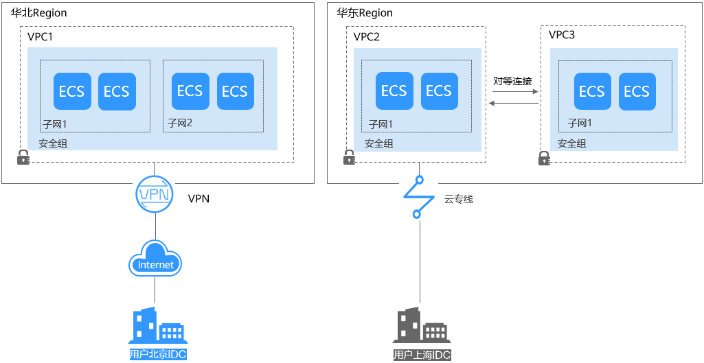

# 网络规划

在创建VPC之前，您需要根据具体的业务需求规划VPC的数量、子网的数量、IP网段划分和互连互通方式等。

## **如何规划VPC数量？**

VPC 具有区域属性，默认情况下，不同区域的VPC之间内网不互通，同区域的不同 VPC 内网不互通，同一个 VPC下的不同可用区之间内网互通。

**一个VPC**

当各业务之间没有网络隔离需求时，您可以只使用一个VPC即可。

**多个VPC**

当您在当前区域下有多套业务部署，且希望不同业务之间进行网络隔离时，则可为每个业务在当前区域建立相应的 VPC。两个VPC之间可以采用对等连接进行互连。如[图1](#fig215117212465)所示。

**图 1**  对等连接  

**最多可以创建多少个VPC？**

默认情况下一个用户下支持创建5个VPC，如果配额不满足实际需求，可以提工单申请扩容。

## **如何规划子网？**

子网是VPC内的IP地址块，VPC中的所有云产品都必须部署在子网内。同一个VPC下，子网网段不可重复。子网创建成功后，网段无法修改。

VPC支持的网段如下表，子网的网段须在VPC网段范围内，且子网的掩码范围为16~28。

**表 1**  VPC网段

<table><thead align="left"><tr id="row8207108124517"><th class="cellrowborder" valign="top" width="50%" id="mcps1.2.3.1.1">
<strong id="b720717819459">网段</strong>

</th>
<th class="cellrowborder" valign="top" width="50%" id="mcps1.2.3.1.2">
<strong id="b1520716894510">可用私网IP数量 （不包括系统保留）</strong>

</th>
</tr>
</thead>
<tbody><tr id="row152071480452"><td class="cellrowborder" valign="top" width="50%" headers="mcps1.2.3.1.1 ">
10.0.0.0/8~24

</td>
<td class="cellrowborder" valign="top" width="50%" headers="mcps1.2.3.1.2 ">
16777212

</td>
</tr>
<tr id="row82089834520"><td class="cellrowborder" valign="top" width="50%" headers="mcps1.2.3.1.1 ">
172.16.0.0/12~24

</td>
<td class="cellrowborder" valign="top" width="50%" headers="mcps1.2.3.1.2 ">
1048572

</td>
</tr>
<tr id="row920814834520"><td class="cellrowborder" valign="top" width="50%" headers="mcps1.2.3.1.1 ">
192.168.0.0/16~24

</td>
<td class="cellrowborder" valign="top" width="50%" headers="mcps1.2.3.1.2 ">
65532

</td>
</tr>
</tbody>
</table>

**规划子网**

-   如果只是VPC的子网规划，不涉及和基础网络或者IDC的网络通信，则可以选择上述任何一个网段进行新建子网。
-   如果要通过VPN/云专线与线下IDC进行互通，本端网段（VPC 网段）和对端网段（您的IDC网段）不能重叠，所以在新建VPC及子网的时候务必避开对端网段。
-   在划分网段时还应考虑该网段的IP容量，即有多少可用的IP数。
-   最后，建议在同个VPC下的业务内可按照业务模块分别划分子网，例如子网1用于Web层，子网2用于逻辑层，子网3用于数据层，有利于结合网络ACL进行访问控制和过滤。

**最多可以创建多少个子网？**

一个用户可以创建100个子网，如果无法满足实际需求，可以提工单申请扩容。

## **如何规划路由策略？**

路由表由一系列路由规则组成，用于控制VPC内子网的出流量走向。用户创建VPC时，系统会自动为其生成一个默认路由表，该默认路由表含义为VPC内网互通。

-   如果不需要对子网的流量走向进行特殊控制，默认VPC内网互通的情况下，则使用默认路由表即可，无需配置自定义路由策略；
-   如果需要对VPC内的网络流量走向进行特殊控制，则可以对路由表进行自定义路由配置。

## **如何连接本地IDC？**

当您有VPC与本地IDC互通的需求时，确保VPC的网段和要互通的网络的网段都不冲突。

如下图所示，比如您在华北有VPC1一个VPC，华东有VPC2和VPC3两个VPC。VPC1需要连接用户北京IDC，通过VPN走Internet互连。VPC2需要连接用户上海IDC，通过云专线连接。同时在华东Region的VPC3与VPC2通过对等连接建立连接。

**图 2**  IDC连接  

此例中，各VPC网段划分需要注意以下几点：

-   VPC1的网段（CIDR）不能与北京IDC的网段有重叠。
-   VPC2的网段（CIDR）不能与上海IDC的网段有重叠。
-   VPC3和VPC2的网段也不能有重叠。

## **如何连接Internet？**

**少量弹性云服务器通过弹性公网IP连接Internet**

当您仅有少量弹性云服务器访问Internet时，您可将弹性公网IP（EIP）绑定到弹性云服务器上，弹性云服务器即可连接公网。您还可以通过动态解绑它，再绑定到NAT网关、弹性负载均衡上，使这些云产品连接公网，管理非常简单。不同弹性公网IP还可以共享带宽，减少您的带宽成本。

**大量弹性云服务器通过NAT网关连接Internet**

当您有大量弹性云服务器需要访问Internet时，单纯使用弹性公网IP管理成本过高，公有云NAT网关来帮您，它提供SNAT和DNAT两种功能。SNAT可轻松实现同一VPC内的多个弹性云服务器共享一个或多个弹性公网IP主动访问公网，有效降低管理成本，减少了弹性云服务器的弹性公网IP直接暴露的风险。支持最大100万并发连接、3万新建连接。DNAT功能还可以实现端口级别的转发，将弹性公网IP的端口映射到不同弹性云服务器的端口上，使VPC内多个弹性云服务器共享同一弹性公网IP和带宽面向互联网提供服务。

**海量高并发场景通过弹性负载均衡连接Internet**

对于电商等高并发访问的场景，您可以通过弹性负载均衡（ELB）将访问流量均衡分发到多台弹性云服务器上，支撑海量用户访问。弹性负载均衡采用集群化部署，支持多可用区的同城双活容灾。同时，无缝集成了弹性伸缩服务，能够根据业务流量自动扩容，保证业务稳定可靠。

**自有IDC场景通过虚拟专用网络/云专线连接Internet**

对于自建IDC机房的用户，由于利旧和平滑演进的原因，并非所有的业务都能放置在云上，这个时候就可以基于虚拟专用网络（VPN）或云专线（DC）产品，实现云上VPC与云下IDC之间的互联。VPN走Internet，公网的价格私网的享受。云专线走专属线路，带给您更高的传输效率和更私密的用户体验。

